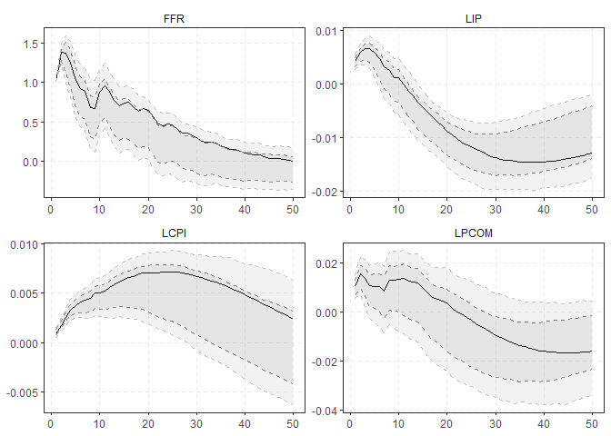

<!--  github_document:
    pandoc_args: --webtex -->

<!-- README.md is generated from README.Rmd. Please edit that file -->

# psvar

<!-- badges: start -->

<!-- badges: end -->

``` r
library(psvar)
dat <- ramey_econ214[, c(5, 2, 4, 6)]
inst <- ramey_econ214[, 10]
```

``` r
model <- estimate_var(dat, p = 12) 
irfs <- irf_psvar(model, m = inst, irhor = 50)
plot_psvar(irfs)
```



``` r
fstat("FFR", exo = c("FFR", "LIP", "LCPI", "LPCOM"), inst = "RRSHOCK",
      lags = 12, data = cbind(dat, inst))
#> $Fn
#>          [,1]
#> [1,] 93.30112
#> 
#> $Fr
#>          [,1]
#> [1,] 11.52777
```

## Installation

You can install the development version from
[GitHub](https://github.com/) with:

``` r
# install.packages("remotes")
remotes::install_github("kvasilopoulos/psvar")
```
